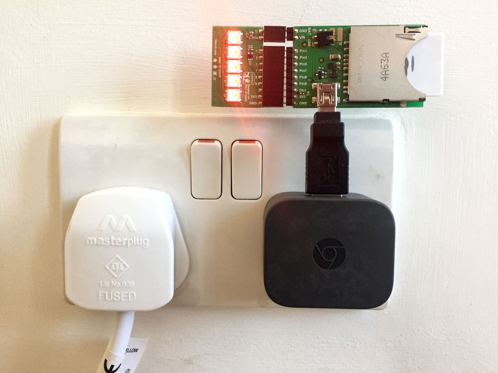
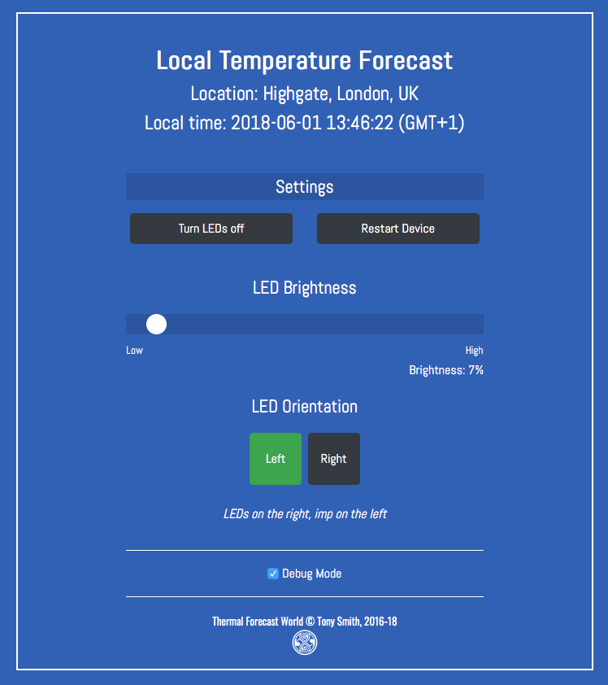

# ThermalForecastWorld 1.10.1 #

This provides code for a simple Electric Imp Platform-based environmental temperature readout device. It is built around the imp001 card, ‘April’ breakout board and the LED Tail.

## Hardware ##

The imp001 slots into the April, the LED Tail fits onto the April’s breakout connector pins. Plug it into a USB adaptor and you’re ready to go. I prefer compact mini USB adaptors:



The lights show the current temperature (top) and the forecast temperature in four-hourly intervals. The colour indicates the temperature in general terms:

```
Red  Orange  Yellow  Green  Blue  White
HOT <----------------------------> COLD
```

### Tip ###

If the LEDs are too bright, you can lower the brightness in the control UK *(see below)*. They may still be sharp: try wrapping a strand of Magic Tape around the LEDs, four or five layers thick. This makes for a good, cheap diffuser.

## Software ##

ThermalForecastWorld requires a free Electric Imp developer account. To find out more and sign up for an account, please see the [Electric Imp Getting Started Guide](https://developer.electricimp.com/gettingstarted).

The agent and device code included in this repository will need to be pasted into the Electric Imp IDE. You will also need my [Location library](https://github.com/smittytone/Location) &mdash; paste it over line 7 in *both* the agent and device code. The Location library requires a [Google-provided API key](https://developers.google.com/maps/documentation/geolocation/intro), which you’ll need to enter into the agent code in the space provided on line 70, which will also need un-commenting.

The code also makes use of Electric Imp’s [DarkSky library](https://developer.electricimp.com/libraries/webservices/darksky) and this also requires its own API key, details of which you will find in the linked library documentation.

## Usage ##

Just plug in and go. The code determines the unit’s location and obtains current and expected temperature data based using that location. The indicates that it is disconnected for some reason with a cycling black dot, or a cycling red dot it it’s trying to connect at start-up.

A simple control UI is now available at the agent URL.



## Release Notes

- 1.10.1 *16 July 2020*
    - Minor refactoring.
- 1.10.0 *15 July 2020*
    - Remodel project to make use of impt and Builder — no changes to app functionality
- 1.9.1 *21 May 2020*
    - Update JQuery to 3.5.x.
    - Update Bootstrap to 4.5.x.
- 1.9.0 *12 May 2020*
    - Fix left/right LED position handling.
    - Add imp orientation images.
    - Support Rocky 3.0.0.
- 1.8.4 *5 September 2019*
    - Update Jquery to 3.4.1, Boostrap to 4.3.1, Simpleslack to 1.0.1, CrashReporter to 1.0.1, Bootmessage to 2.2.2
- 1.8.3 *18 April 2019*
    - Update JQuery to 3.4.0
- 1.8.2 *16 April 2019*
    - Fix Controller support
- 1.8.1 *28 March 2019*
    - Update dependencies:
        - [DarkSky library](https://developer.electricimp.com/libraries/webservices/darksky)
        - [Location 1.5.3](https://github.com/smittytone/Location)
        - [Utilities 3.1.0](https://github.com/smittytone/generic)
- 1.8.0 *12 March 2019*
    - Update Web UI HTML, API; refactor Web UI JavaScript
    - Stop the device signalling its readiness twice
    - Update dependencies
- 1.7.1 *1 November 2018*
    - Update dependencies
- 1.7.0 *27 September 2018*
    - Send device settings as JSON
    - Add DarkSky call count check
- 1.6.0 *29 August 2018*
    - Add [DisconnectionManager 2.0.0](https://github.com/smittytone/generic/blob/master/disconnect.nut)
    - Add [Utilities](https://github.com/smittytone/generic/blob/master/utilities.nut) library
    - Add universal exception handler
    - Bug fixes
- 1.5.0 *7 June 2018*
    - Update to [Bootstrap 4.1.1](https://getbootstrap.com/)
        - Update Web UI based on Bootstrap
        - Separate out Web UI into own file for clarity
    - Add support for [Location 1.5.0](https://github.com/smittytone/Location)
    - Update to [JQuery 3.3.1](https://jquery.com)
    - Prevent Ajax XHR caching
    - Add 'connecting' indicator (in addition to existing 'disconnected' indicator)
- 1.4.0 *7 February 2018*
    - Add support for [Location 1.4.1](https://github.com/smittytone/Location)
- 1.3.0
    - Add support for [Location 1.3.0](https://github.com/smittytone/Location)
    - Update and improve the control UI
    - Update to JQuery 3.2.1
    - Fix assorted typos in code and Read Me
    - Add release notes to Read Me

## Licence ##

ThermalForecastWorld is licensed under the terms and conditions of the [MIT Licence](./LICENSE).

ThermalForecastWorld is copyright &copy; 2016-20 Tony Smith.
